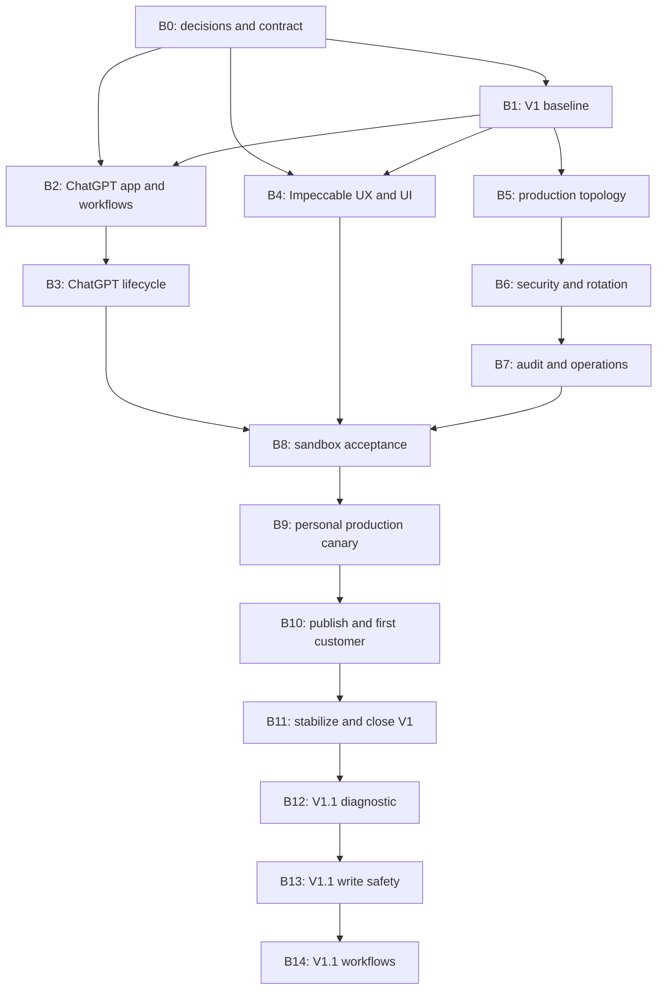

# Production Execution Program

## Status and authority

- **Purpose:** execute the remaining work from the current V1 candidate through
  a clean production launch, the first customer cohort, stabilization, and the
  approved V1.1 package.
- **Product source of truth:** [`../PRODUCT.md`](../PRODUCT.md).
- **Remote runtime and promotion contract:**
  [`REMOTE_MCP_CLOUDFLARE.md`](REMOTE_MCP_CLOUDFLARE.md).
- **Operational procedures:** [`OPERATOR_RUNBOOK.md`](OPERATOR_RUNBOOK.md).
- **This document owns:** execution order, block boundaries, delegation,
  validation, review, evidence, and promotion gates.
- **This document does not own:** new product commitments, security or privacy
  decisions, provider choices, retention decisions, live authorization, or
  irreversible cleanup.
- **Claude policy:** Claude is unavailable and must not be used for planning,
  implementation, challenge, or code review. Existing Claude delivery remains
  compatible until the operator explicitly decides to retire it.
- **Customer-surface policy:** the primary V1 customer surfaces are the
  unified ChatGPT desktop app (with Codex) and ChatGPT Web. Codex CLI/IDE are
  technical/operator fallbacks, not a customer promise. Existing Claude
  delivery remains compatibility-only.

The current known candidate is branch
`codex/rebaseline-v1-sandbox-acceptance`, commit `9de8d0c`. Before execution,
the orchestrator must verify the actual Git state and must not assume that this
reference is still current.

## Target outcome

The program is complete when:

1. the V1 multi-tenant code is integrated and reproducible;
2. the private ChatGPT Pipedrive app can be installed by named pilot
   workspaces/users without duplicate MCP registration;
3. two real Access users can connect two different Pipedrive companies in
   sandbox without cross-tenant leakage;
4. production and sandbox infrastructure, secrets, data, and artifacts are
   mechanically separated;
5. durable audit export, alerting, incident response, offboarding, rollback,
   and operating ownership are proven;
6. Alexandre can use the private ChatGPT Pipedrive app against Pezzos Labs in
   a read-only production canary;
7. a first customer can connect their own Pipedrive identity and company
   without a customer-specific Worker or credential;
8. the service completes an agreed stabilization window with no unresolved
   high-severity finding;
9. the operator has made a separate decision on general availability and
   legacy singleton cleanup;
10. the approved V1.1 slices are implemented only after the V1 launch boundary
    is satisfied.

## Program invariants

These rules apply to every block.

### Product and security

- Every Pipedrive connection is bound to the caller's verified Cloudflare
  Access subject and verified Pipedrive company.
- No credential is shared across users or companies.
- Every new `(Access sub, company_id)` policy starts read-only.
- Writes retain `dry_run=true` by default.
- Delete and Mailbox authority remain independently gated.
- Unknown, unapproved, and suspended domains fail closed without enumeration.
- No rollback may restore a singleton credential path.
- Tokens, assertions, OAuth codes, raw emails, raw CRM payloads, and secret
  values never enter logs, evidence, prompts, documents, or reviewer reports.

### Delegation

- Material reasoning happens first with GPT-5.6 Sol.
- Repository implementation is delegated to GPT-5.6 Tera.
- Only one repository writer may be active at a time.
- Children may not recursively delegate.
- Reviewers are read-only unless a test command necessarily refreshes ignored
  build artifacts; even then, no other writer may be active.
- Live actions remain parent-controlled.
- A child never commits, pushes, deploys, publishes, changes secrets, changes
  Access, promotes a Pipedrive application, or handles customer credentials.

### Documentation and verification

- Behavior changes update canonical documentation in the same block.
- Every stable block receives targeted tests, the relevant full gate, two
  independent review perspectives, and an atomic commit.
- Claims of completion require fresh evidence from the current checkout.
- The tracked workflow observation log, if dirty, is preserved and excluded
  from product commits.

## Standard block protocol

Every block is executed through the following state machine.

### Phase A: intake and execution envelope

The parent:

1. verifies Git status, current commit, previous block evidence, and applicable
   repository guidance;
2. identifies user-owned decisions and live effects;
3. establishes one bounded execution envelope for the block;
4. names allowed task classes, files, tests, dirty-file policy, review cadence,
   recovery budget, stop conditions, and delegation budget.

Default local envelope:

- allowed: read-only investigation, local repository writes, local builds,
  local tests, local documentation, exact-path staging, and atomic commits;
- excluded: fetch, pull, push, PR, release, publication, deployment, remote
  configuration, secrets, OAuth, customer data, real CRM operations, provider
  promotion, and destructive cleanup;
- delegation: one Sol architect, one Tera writer, one specialist tester or
  reviewer; concurrency is allowed only for read-only work; depth one; no
  recursion.

### Phase B: Sol architecture and challenge

The Sol agent receives a narrow prompt and returns:

- evidence and assumptions;
- proposed architecture or change shape;
- exact file ownership for the writer;
- public and persisted contracts affected;
- threat, privacy, UX, migration, and rollback analysis;
- required tests;
- documentation changes;
- user-owned decisions;
- stop conditions;
- an implementation packet suitable for a context-light Tera agent.

No writer is launched until the parent accepts this packet.

### Phase C: Tera implementation

The Tera agent:

- uses `gpt-5.6-terra`;
- receives the accepted packet rather than the full conversation;
- owns only the named files;
- is told that other work may exist and must not be reverted;
- implements code, tests, and block documentation;
- runs targeted checks;
- reports changed paths, commands, results, risks, and remaining gaps;
- stops on public-contract, security, retention, migration, UX, or live-effect
  uncertainty.

### Phase D: verification and review

After the writer stops:

1. the parent audits Git state and the changed paths;
2. the specialist agent runs or reviews the block-specific tests;
3. the original Sol agent receives a follow-up task to review conformance,
   architecture, security, and unresolved findings;
4. accepted agent-owned findings return to the same Tera agent;
5. focused tests and both reviews are repeated after remediation;
6. the parent runs the final full gate.

### Phase E: documentation, commit, and transition

The parent:

- aligns durable documents;
- records fresh evidence in this program's status table or a linked evidence
  record;
- stages exact owned paths;
- creates one coherent commit;
- marks the block complete only when all exit criteria pass;
- moves to the next local block automatically;
- pauses only for a user-owned decision or an external-effect gate.

## UI and UX protocol

Any work that affects HTML pages, onboarding, client-facing installation,
confirmation flows, settings, error copy, visual metadata, or responsive
behavior must use the `impeccable` skill.

Current preconditions:

- `PRODUCT.md` exists and is valid;
- the register is `product`;
- `DESIGN.md` is missing and must be created before UI implementation.

Required sequence:

1. run the Impeccable context loader;
2. run `$impeccable document` to establish `DESIGN.md`;
3. run a task-specific `$impeccable shape` interview;
4. collect at least one user-answer round;
5. resolve the image probe gate;
6. present the brief and wait for explicit user confirmation;
7. load the required craft references;
8. before editing UI files, emit:

```text
IMPECCABLE_PREFLIGHT: context=pass product=pass command_reference=pass shape=pass image_gate=pass mutation=open
```

9. implement with the Tera writer;
10. run Impeccable critique, audit, remediation, and polish;
11. complete accessibility, keyboard, zoom, reflow, and responsive evidence.

`PRODUCT.md`, `DESIGN.md`, or an agent-authored summary never substitutes for
explicit shape-brief approval.

## Authority gates

| Gate | Allowed effects | Typical examples |
| --- | --- | --- |
| `L0` | Local read only | Repository inspection, planning, diff review |
| `L1` | Local writes | Code, tests, docs, builds, artifacts, commits |
| `SR` | Sandbox or external read | Deployment list, health, logs, read-only checks |
| `SW` | Sandbox mutation | Deploy, rollback, Access change, OAuth, disposable write |
| `PW` | Production or publish mutation | DNS, secrets, deploy, app promotion, release |
| `CW` | Customer-scoped effect | Access admission, tenant approval, CRM read/write, offboarding |
| `DW` | Destructive effect | Singleton purge, token revocation, tenant deletion |

No gate inherits the authority of a later gate. A production deploy does not
authorize publication, onboarding, customer reads, writes, or cleanup.

## Dependency map



## Progress register

Allowed states are `not_started`, `planning`, `blocked_user`, `in_progress`,
`review`, `completed`, and `superseded`.

| Block | State | Commit or evidence | External gate |
| --- | --- | --- | --- |
| B0 Decisions and contract | completed | ADR-0001 + structured record; full local gate 2026-07-20: `WRANGLER_SEND_METRICS=false npm run check` 115/115, benchmark p95 3.295ms <20ms, `npm pack --dry-run`, `git diff --check`; original Sol PASS; compliance-legal PASS | B7/B8 sandbox-only risk exception; completed D08 before B9/B10, billing, or additional customer |
| B1 V1 baseline | completed | Candidate `9de8d0c69daeb6cd4a882d66a8e231eacf7f314b`; [B1 baseline evidence](../evidence/B1-v1-baseline.md): 118/118 local check, benchmark p95 3.34ms <20ms, 21-file pack exclusions, offline cache audit 0 (non-fresh), original Sol PASS, security-specialist PASS | Push/PR excluded; sandbox/live acceptance remains B8 |
| B2 ChatGPT app and workflows | completed | [B2 evidence](../evidence/B2-chatgpt-plugin.md): 19/19 focused, 124/124 full check, benchmark p95 3.383ms <20ms, dry-run pack, offline cache-backed audit 0; workflow-specialist findings remediated; original Sol final PASS. B3 local lifecycle is completed; real-surface installation/assignment, OAuth/authentication, tool discovery/actions, and first safe read remain deferred to B8. | None for local package |
| B3 ChatGPT lifecycle | completed | [B3 evidence](../evidence/B3-chatgpt-lifecycle.md): isolated receipt-bound marketplace lifecycle, 11-case acceptance, 21/21 focused and 126/126 full checks, p95 3.505ms <20ms, 0.3.4 22-file dry-run pack, cache-backed/non-fresh offline audit 0, `git diff --check`, workflow-tester final PASS, and original Sol final PASS after remediation. | Real ChatGPT/Access acceptance deferred to B8 |
| B4 Impeccable UX/UI | completed | [B4 UI evidence](../evidence/B4-impeccable-ui.md): approved A1/B1 briefs and user-approved image skip; actual local server renderers, recovery and trusted ticket projection; 130/130 full local check, 26/26 browser matrix, p95 3.384ms <20ms, 22-file dry-run pack, high-level audit pass with one low transitive `body-parser` finding, `git diff --check`, accessibility-tester final PASS, original Sol final PASS, no Claude. | None for local UI; live UI/OAuth remains B8 |
| B5 Production topology | completed | [B5 topology evidence](../evidence/B5-production-topology.md): 14/14 focused, 144/144 full check, sandbox/production dry-runs, p95 3.562ms <20ms, 22-file dry-run pack, offline high audit 0, original Sol PASS, devops-automator PASS; production client metadata remains intentionally missing and blocks production preparation. | Protected deploy remains separately authorized; remote reservation excluded |
| B6 Security and rotation | completed | [B6 security and rotation evidence](../evidence/B6-security-rotation.md): local-only B6 gate 126/126, later proof 54/54, final canonical check 179/179; original Sol and security-specialist PASS | Secret/MFA drill excluded |
| B7 Audit and operations | in_progress | [B7 evidence](../ops/evidence/B7-audit-operations.md): hash-verified limited synthetic sandbox evidence, historical cutover gate 229/229, current post-ack gate 237/237, and separate SR/SW validation authorities recorded with no live effect | Execute the authorized sandbox validation packet, then obtain its exhaustive evidence and remaining non-backup live checks; production durability/routing is future scope outside B7 |
| B8 Sandbox acceptance | not_started |  | B7 complete, recorded pilot exception receipt, exact `SR`/`SW`/`CW` where applicable |
| B9 Personal production canary | not_started |  | Completed D08 plus `PW` |
| B10 Publish and first customer | not_started |  | Completed D08 plus `DW`/`PW`/`CW` |
| B11 Stabilize and close V1 | not_started |  | Verifies prior singleton-purge evidence only |
| B12 V1.1 diagnostic | not_started |  | Publication deferred |
| B13 V1.1 write safety | not_started |  | Real write tests deferred |
| B14 V1.1 workflows | not_started |  | Publication and customer use deferred |

## B0: decisions and execution contract

### Objective

Close all decisions that affect production, distribution, customer commitment,
security, privacy, retention, costs, and irreversible actions.

### Entry

- Current repository and canonical documents are readable.
- No live authority is required.

### Sol assignment

Create a decision dossier covering:

- ChatGPT customer surfaces promised;
- Pipedrive sandbox and production application strategy;
- private or public Pipedrive distribution;
- private or public ChatGPT installation;
- production hostname and Cloudflare account boundary;
- skill bundle composition;
- existing Claude delivery compatibility or retirement;
- audit destination, retention, access, deletion, alerting, and cost;
- administrator, backup operator, support, incident, and offboarding owners;
- SLO, RTO, RPO, capacity, and cost budgets;
- encryption and HMAC rotation posture;
- canary users, companies, records, permissions, and soak window;
- privacy notice, DPA, subprocessors, DSAR, and breach workflow;
- passive singleton retention and future purge conditions.

Use `grill-me` for dependent user-owned decisions after inspectable facts are
exhausted.

### Tera ownership

- this execution program;
- a delivery ADR;
- a structured decision record;
- product and operator documentation only after decisions are accepted.

The accepted B0 contract is recorded in
[`decisions/0001-production-delivery-contract.md`](decisions/0001-production-delivery-contract.md)
and [`decisions/B0-production-decisions.json`](decisions/B0-production-decisions.json).

### Tests and review

- no unresolved decision on the first-client critical path;
- no contradiction with `PRODUCT.md`;
- no secret or customer PII;
- review by the original Sol agent and `compliance-legal`.

### Exit

Every critical decision has a value, owner, evidence, ISO last-reviewed date,
next review gate, and revisit trigger. No `TBD` remains on the B1 through B10 path. D08 is designated-not-activated: access is production-activation-only and Alexandre-only audit reads and alert routing remain until completion. A narrow recorded-receipt, one-customer unpaid informed sandbox exception applies only to B7/B8 with exact authority and stops on billing, additional access, production data/traffic, public availability, or security incident; it never applies to B9/B10.

### Stop

Stop before B5 or any live work when retention, privacy, audit, production
admin, app distribution, incident, or offboarding ownership remains open.

## B1: integrate and qualify the V1 baseline

### Objective

Integrate the current candidate as one coherent V1 baseline before ChatGPT app or
production adaptations.

### Sol assignment

Verify:

- actual diff from `main`;
- branch and commit identity;
- multi-tenant invariants;
- v2 Durable Object compatibility;
- test and documentation freshness;
- rollback compatibility;
- unrelated dirty paths.

### Tera ownership

Only defects found in:

- V1 remote runtime;
- tenancy and security tests;
- operator documentation;
- build configuration.

Do not implement V1.1 or ChatGPT app packaging here.

### Validation

```sh
npm ci
WRANGLER_SEND_METRICS=false npm run check
npm run benchmark:server
npm pack --dry-run
git diff --check
npm audit --audit-level=high
```

Focused tests must cover isolation, domain and company mismatch, refresh
coalescing, callback and disconnect races, suspension, purge, admin projection,
redaction, workerd routing, and the absence of singleton fallback.

### Documentation

Record the exact candidate, fresh evidence, remaining live gates, and rollback
requirements.

### Review

Original Sol agent plus `security-specialist`.

### Exit

Clean product paths, fresh green gates, aligned status, atomic commit, and an
exact candidate ready for a separately authorized push or PR.

## B2: private ChatGPT Pipedrive app and canonical workflows

### Objective

Add one private ChatGPT Pipedrive app without creating divergent workflow
sources or weakening the existing compatibility delivery.

### Sol assignment

Freeze:

- canonical workflow source;
- one-app catalog and naming;
- ChatGPT app packaging and installation contract;
- one MCP configuration contract;
- private-distribution metadata;
- version coupling;
- standalone limitations;
- Claude compatibility boundary.

The low-risk starting point is to keep the current seven workflow files as the
canonical source and generate the private ChatGPT artifact from them. A later
move to a neutral source directory must be atomic and byte-verifiable.

### Tera ownership

- ChatGPT app packaging paths selected by B2;
- workflow catalog and app manifest;
- ChatGPT app pack scripts;
- package commands;
- ChatGPT app package tests.

### Required artifacts

- one private ChatGPT Pipedrive app containing exactly one approved Pipedrive
  MCP;
- all seven canonical workflows in that app;
- private-installation metadata for named pilot workspaces/users;
- deterministic hashes and version metadata.

The app does not split workflows into thematic bundles. It never enables
Writes, Deletes, Mailbox, Access membership, tenant approval, or OAuth.

### Validation

- canonical seven-workflow exact-set checks;
- packaging metadata and directory-name checks;
- byte identity where a compatibility delivery shares a workflow source;
- required dry-run and approval instructions;
- one MCP server only;
- exact environment URL;
- no secret, header, token, source, test, symlink, nested archive, local
  server, or MCPB in the private ChatGPT artifact;
- deterministic rebuild.

### Documentation

Create `CHATGPT_DELIVERY.md`, an installation overview, limitations, and
duplicate-server warnings. Keep Claude documentation compatibility-only.

### Review

Original Sol agent plus `workflow-tester`.

### Exit

A local, deterministic, sandbox-labelled private ChatGPT app with all seven
canonical workflows passes all artifact tests.

## B3: ChatGPT install, update, uninstall, and clean-profile acceptance

### Objective

Prove the complete ChatGPT app lifecycle without mutating a real user profile during
automated tests.

### Sol assignment

Define private installation, direct MCP technical fallback, Codex CLI/IDE
technical fallback, conflict detection, update, disable, uninstall, remote
disconnect, and provider revocation semantics.

### Tera ownership

- clean app-profile fixtures;
- lifecycle scripts;
- release manifest;
- lifecycle tests;
- ChatGPT app installation and troubleshooting documentation.

### Automated matrix

1. Empty named-pilot profile receives the private app through the accepted
   installation path.
2. Install adds the intended skills and one MCP server.
3. No package file requests a secret.
4. Update replaces managed content without duplication.
5. Disable and enable preserve intended state.
6. Uninstall removes only plugin-managed state.
7. Unrelated profile data remains unchanged.
8. Reinstall succeeds.
9. Existing same-name MCP produces a clear conflict.
10. Offline MCP produces actionable guidance.
11. Selective and full skill installs are deterministic.

### External acceptance

Deferred to B8:

- current ChatGPT desktop/web surface;
- accepted ChatGPT/Access sign-in path;
- Cloudflare Access;
- tool discovery;
- `/pipedrive`;
- first safe read.

### Documentation

Explain the difference between plugin uninstall, `/pipedrive` disconnect,
Access removal, and provider-side Pipedrive revocation.

### Review

Original Sol agent plus `workflow-tester`.

### Exit

Install, update, disable, uninstall, and reinstall pass in a clean isolated
profile with no residue or duplicate connector.

## B4: Impeccable UI and onboarding

### Objective

Create a coherent, accessible, server-rendered product UI for ChatGPT app onboarding,
connection, settings, administration, confirmation, errors, and recovery.

### Required design phases

1. Create and approve `DESIGN.md` with `$impeccable document`.
2. Run one shape flow for end-user onboarding, `/pipedrive`, and `/settings`.
3. Run a second shape flow for `/admin/pipedrive` and confirmation pages.
4. Resolve image probes and north-star comparisons.
5. Obtain explicit user approval for both briefs.
6. Open the mutation gate and launch the Tera writer.

### Sol assignment

Analyze user journeys, safety language, content ranges, error and reconnect
states, administration density, CSP constraints, accessibility, and the
boundary between current V1 and future V1.1 UI.

### Tera ownership

- shared server-rendered page shell and style tokens;
- `userConnectionPage.ts`;
- `settingsPage.ts`;
- `pipedriveAdminPage.ts`;
- confirmation surfaces;
- browser and accessibility fixtures;
- approved plugin visual metadata.

### UI invariants

- no client JavaScript without separate justification and CSP review;
- nonce-bound CSS and existing fail-closed security remain intact;
- restrained product color strategy using OKLCH;
- system-font product typography;
- no pure black or white;
- no decorative motion, glassmorphism, gradient text, side stripe, artificial
  card grids, or non-standard form affordances;
- clear current company and next safe action;
- read-only default remains visible;
- destructive and authority-increasing consequences precede confirmation;
- cancellation and recovery routes are explicit.

### Validation

- HTML escaping and CSP;
- headings, landmarks, labels, descriptions, status semantics;
- keyboard-only navigation;
- focus and touch targets;
- axe WCAG AA;
- contrast;
- zoom at 200 percent;
- mobile, tablet, and desktop reflow;
- long domain, company, and email fixtures;
- empty, success, error, reconnect, disconnected, and dense-admin states;
- existing PII and token leakage assertions;
- Impeccable critique, audit, remediation, polish, and final audit.

### Review

Original Sol agent plus `accessibility-tester`.

### Exit

Both briefs are accepted, browser evidence passes, accessibility findings are
closed, security is unchanged, and UI documentation matches the implementation.

## B5: production topology and release boundary

### Objective

Make sandbox and production mechanically distinct and reproducible.

### Sol assignment

Choose and document:

- separate Wrangler environments or config files;
- Worker names and hostnames;
- Access applications and audiences;
- Pipedrive applications and callbacks;
- Durable Object namespaces and migrations;
- variable and secret boundaries;
- manual protected deployment;
- artifact provenance.

### Tera ownership

- Wrangler configuration;
- environment validators;
- CI and release workflows;
- provenance manifest;
- configuration tests;
- promotion and rollback documentation.

### Requirements

- no environment depends on ambiguous `keep_vars` behavior;
- production artifacts contain no sandbox URL;
- sandbox artifacts contain no production URL;
- secrets are referenced by name only;
- CI does not automatically deploy production;
- release records include Git SHA, lockfile hash, Node/Wrangler versions,
  Worker dry-run bundle hash, client hashes, and target environment;
- deployment requires a protected manual gate.

### Validation

- Worker dry-run for each environment;
- config schema and binding validation;
- migration validation;
- environment URL scans;
- reproducible clean build;
- provenance and artifact hash comparison.

### Review

Original Sol agent plus `devops-automator`.

### Exit

Sandbox and production cannot share a hostname, callback, audience, namespace,
or client artifact accidentally.

## B6: security hardening, capacity, and rotation

### Objective

Close remaining abuse, key, secret, administrator, and capacity risks before
live acceptance.

### Sol assignment

Produce a focused threat model for:

- request size and resource exhaustion;
- per-user, tenant, IP, and provider rate limits;
- concurrency and load shedding;
- registry capacity;
- admin compromise;
- OAuth client-secret compromise;
- encryption-key compromise and planned rotation;
- HMAC rotation and correlation epochs;
- Access issuer and audience cutover.

### Tera ownership

- input and body limits;
- stable redacted rate-limit errors;
- key validation;
- audit-key epoch;
- optional encryption `kid` and keyring selected in B0;
- security tests;
- rotation and compromise runbooks.

### Validation

- missing or invalid keys fail closed;
- unknown and retired key identifiers;
- previous/current key behavior when enabled;
- audit epoch behavior;
- oversized requests;
- bounded concurrency and rate limiting;
- Pipedrive 429 handling;
- exact admin denial;
- no secret in logs, errors, or evidence;
- full tenancy, race, and security tests;
- full `npm run check`.

### Review

Original Sol agent plus `security-specialist`.

### Exit

Abuse controls and compromise recovery are tested, and the selected rotation
posture is explicit.

## B7: durable audit, observability, operations, and legal readiness

### Objective

Remove the explicit production blocker caused by console-only audit events and
unowned operations.

### Entry

- Local implementation may proceed under `L1`.
- Before B7 sandbox action, the one-customer unpaid informed pilot receipt, dedicated sandbox R2 policy (30-day retention, Alexandre-only reads), safe data scope, five stop triggers, and exact `SW` are recorded; this exception waives only active D08 and never production or legal authority.

### Sol assignment

Define:

- Logpush or SIEM destination;
- retention, access, deletion, immutability, and costs;
- audit schema and environment/version fields;
- export freshness;
- dashboards and alerts;
- SLO, RTO, RPO;
- incident and offboarding workflows;
- customer support and legal artifacts.

### Tera ownership

- audit schema and validation;
- export configuration templates;
- alert and dashboard definitions where code-manageable;
- validation scripts;
- runbooks and evidence templates;
- privacy, support, and offboarding drafts. The final privacy notice, DPA,
  subprocessor, DSAR, and breach-response pack remains due after B9 and before
  B10, as defined by B0.

### Minimum signals

- Access and JWKS failures;
- OAuth starts, callbacks, refresh, reconnect, and invalid grants;
- tenant admission and registry failures;
- authority increases and reductions;
- approval, suspension, resume, and disconnect;
- Durable Object error, latency, alarm delay, and purge;
- Pipedrive 401, 403, 429, 5xx, and timeout;
- route latency and outcome;
- export freshness and parse failure;
- registry capacity;
- request, CPU, storage, and provider cost.

### Validation

Local:

- one schema-valid audit for every authority-changing action;
- redacted success, denial, and error events;
- observable export failure;
- bounded identifiers and versions;
- no email, token, JWT, secret, or CRM payload.

Sandbox, under `SW` authorization:

1. produce one anonymous denial;
2. perform one safe read;
3. change one permission;
4. suspend and resume one sandbox tenant;
5. find all events by request ID;
6. trigger and acknowledge export-freshness and provider-error alerts.

### Review

Original Sol agent plus `compliance-legal`; the parent additionally verifies
security-sensitive findings.

### Exit

Audit is durable and queryable, alert routing is proven, owners are named, and
the legal/privacy draft package is ready for its mandatory post-B9, pre-B10
finalization gate.

## B8: complete sandbox and ChatGPT app acceptance

### Objective

Prove V1 isolation, lifecycle, UI, ChatGPT app delivery, and operations with two real
users and two distinct Pipedrive companies.

### Entry

- B1 through B7 complete;
- before B8 sandbox action, B7 is complete and the one-customer unpaid informed pilot receipt, stop triggers, and exact `SR`/`SW`/`CW` where applicable are recorded; `CW` remains required for customer-scoped external effects;
- Pipedrive application installable in two distinct non-production companies;
- two named test identities;
- safe expected records;
- durable audit active;
- candidate and v2-compatible rollback recorded;
- exact `SR` and `SW` authorization.

### Sol assignment

Finalize the evidence plan, safe record scope, concurrency recipe, negative
cross-tenant probes, stop conditions, and rollback triggers.

### Tera ownership

- acceptance scripts;
- ChatGPT app prompt/evaluation corpus;
- redacted evidence template;
- local fixtures only.

The parent performs live steps. Defects return to the owning earlier block and
must requalify all affected gates.

### Acceptance sequence

1. `/healthz` reports Streamable HTTP.
2. Anonymous `/mcp` is denied and audited.
3. A clean named-pilot ChatGPT profile installs and authenticates the MCP.
4. User A connects Company A.
5. User B connects Company B.
6. Each verifies `/pipedrive` and `pipedrive_connection_check`.
7. Each performs one known read.
8. Known reads run interleaved and concurrently.
9. Cross-tenant selection attempts through all controllable surfaces fail.
10. Failed replacement preserves the current connection.
11. New connections start read-only.
12. Writes require explicit elevation and retain dry-run by default.
13. One disposable sandbox write runs only if exactly authorized.
14. Refresh is coalesced.
15. Suspension during OAuth, callback, refresh, and MCP fails closed.
16. Resume restores only retained valid connections.
17. Self-disconnect affects one user.
18. Force-disconnect affects one selected user.
19. Admin pages expose only bounded approved metadata.
20. The inactivity alarm proves purge behavior within the operational window.
21. All seven canonical workflows trigger and remain within their safety contracts.
22. Update, disable, uninstall, and reinstall remain clean.

### Evidence

Keep only hashes, version IDs, request IDs, pseudonymous users, expected company
IDs, bounded record IDs, timestamps, audit receipts, and pass/fail results.

### Review

Original Sol agent plus `api-tester` or `workflow-tester`.

### Exit

Every V1 acceptance criterion passes. Any cross-tenant observation freezes the
rollout and opens an incident; it is never treated as an ordinary retry.

## B9: personal production canary

### Objective

Let Alexandre use the private ChatGPT Pipedrive app against Pezzos Labs before
any customer is admitted.

### Entry

- B8 complete;
- the sandbox exception does not apply: completed D08 is required; `PW` authority does not bypass this prerequisite;
- go-live packet accepted;
- a controlled canary authorization/evidence packet accepts the exact opaque
  IDs for a dedicated synthetic organization, person, deal, and activity. The
  corpus has no email, phone, notes, or real data; its creation remains a
  separately authorized live action, and no opaque ID belongs in canonical or
  public documentation;
- exact `PW` authorization for each production action;
- production rollback target recorded;
- incident and global-freeze paths staffed.

### Sol assignment

Review the exact candidate, config, audit, rollback, smoke sequence, observation
window, and stop thresholds.

### Tera ownership

Only local smoke scripts, evidence templates, or in-scope defect fixes.

### Parent-controlled production sequence

1. Rebuild the accepted source and compare provenance.
2. Configure the separate production Worker, DNS, Access, secrets, bindings,
   audit, and Pipedrive application.
3. Deploy and record the resulting version.
4. Verify health, anonymous denial, Access, audit, admin, and empty tenant state.
5. Allow only Alexandre.
6. Approve only Pezzos Labs.
7. Install the private staged ChatGPT Pipedrive app.
8. Connect Alexandre's own Pipedrive identity.
9. Verify company, identity, connection, and one safe read against only the
   controlled packet's synthetic corpus; do not record opaque IDs in canonical
   or public evidence.
10. Keep Writes, Deletes, and Mailbox disabled.
11. Exercise suspension and disconnect.
12. Observe for seven calendar days and at least five successful active
    sessions, as approved in B0.

### Stop

Stop and roll back or freeze on version mismatch, missing audit, wrong identity
or company, unexpected write authority, sensitive log content, repeated refresh
failure, unexplained tenant state, or incompatible rollback.

### Review

Original Sol agent plus `workflow-tester`.

### Exit

Pezzos Labs is stable in read-only production use, telemetry is healthy, and
rollback remains available.

## B10: deliver the private ChatGPT app and onboard the first customer

### Objective

Publish the accepted production artifact and onboard one customer without a
customer-specific Worker, token, or code fork.

### Entry

- B9 complete;
- the sandbox exception does not apply: completed D08 is required; `DW`, `PW`, or `CW` authority does not bypass this prerequisite;
- an operator checklist/evidence reference records the completed review of
  Alexandre's support, incident-command, and offboarding concentration risk;
- after B9, the final privacy notice, DPA, subprocessor list, DSAR workflow,
  and breach-response pack are accepted in the required operator/legal review.
  This is an entry requirement, not a claim that approval already exists;
- before customer onboarding, the singleton purge is completed under separate
  explicit `DW` authorization within 14 days after cutover, after proof of no
  route, fallback, or v2 binding read path, all intended per-user credentials,
  rollback independence, and a redacted audit receipt;
- support coverage active;
- exact publication and customer authorization;
- accepted production artifact and hashes.

### Sol assignment

Review release immutability, customer expectations, permissions, validation
records, support, privacy, offboarding, and V1 limitations.

### Tera ownership

- release orchestration;
- manifests and hashes;
- release notes;
- English and French onboarding;
- customer checklist;
- troubleshooting and offboarding.

### Publication

- production URL only;
- immutable versioned artifact;
- verified marketplace or private distribution;
- fresh-profile install from the published source;
- no sandbox, secret, local server, or duplicate Pipedrive connector.

### Customer sequence

1. Admit the exact user or group through Access.
2. Approve the exact company domain.
3. Install and authenticate the private ChatGPT Pipedrive app.
4. Complete personal Pipedrive OAuth.
5. Verify the displayed company and identity.
6. Perform a known read-only query.
7. Repeat Pezzos/customer interleaved isolation.
8. Explain permissions, dry-run, support, suspension, and offboarding.
9. Exercise safe suspension or disconnect where contractually agreed.
10. Keep Writes, Deletes, and Mailbox disabled through the first customer
    canary unless separately authorized.

### Review

Original Sol agent plus `end-user-critic`.

### Exit

The first customer confirms the correct identity, company, records, read-only
default, support route, and offboarding expectations.

## B11: stabilize, close V1, and decide general availability

### Objective

Convert the bounded pilot into a supportable production service and close the
V1 release.

### Sol assignment

Analyze the agreed observation window across errors, latency, refresh, alarms,
audit, costs, support, capacity, incidents, and customer feedback.

### Tera ownership

Only accepted reliability, instrumentation, documentation, packaging, and
regression fixes.

### Validation

- no cross-tenant anomaly;
- no unresolved high-severity finding;
- refresh and alarms healthy;
- alert routing proven;
- costs within budget;
- support and offboarding workable;
- registry capacity below the accepted threshold;
- rollback and incident paths still available.

### Final review waves

Run with no active writer.

Wave A:

- `security-specialist`;
- `backend-architect`;
- `api-tester`.

Wave B:

- `workflow-tester`;
- `accessibility-tester`;
- `documentation-steward`.

Use separate read-only review envelopes of at most three agents. Accepted
findings return to one serial Tera remediation pass, followed by both relevant
review waves and the full verification gate.

### Legacy singleton evidence verification

B11 verifies the redacted evidence that the required singleton purge completed
before customer onboarding in B10. It does not schedule, authorize, or perform
purge. Provider-grant revocation remains separately authorized only when the
grant can be safely identified without secret exposure.

### Exit

The operator explicitly chooses limited pilot, a new cohort, or general
availability. V1.1 starts only after this boundary or another explicit product
decision.

## B12: V1.1 diagnostic, capabilities, and guided repair

### Objective

Implement the first approved V1.1 slice without changing the V1 authority
model.

### Sol assignment

Design user-scoped diagnostic snapshots, environment classification,
capability evidence, provider check rate limiting, guided repair, privacy,
connection revisions, and inactivity-clock semantics.

### Tera ownership

- user-scoped diagnostic and capability state;
- cache and one-per-minute live provider check;
- production/sandbox configuration;
- repair codes and allowlisted actions;
- invalidation after reconnect;
- tests and ChatGPT app workflow updates.

### Validation

- cross-user and cross-company isolation;
- freshness and stale behavior;
- missing scope or suite;
- provider outage and 429;
- repair ownership;
- no secret or PII;
- diagnostic and capability probes do not postpone token cleanup.

### UI/UX

Any diagnostic or environment UI requires a new Impeccable shape, approval,
craft, audit, and polish cycle.

### Review

Original Sol agent plus `api-tester`.

### Exit

The slice passes its local and sandbox acceptance and receives separate release
authorization.

## B13: V1.1 account reminder, duplicate protection, and safe links

### Objective

Make real writes safer through account context, durable replay protection,
bounded duplicate detection, uncertain-outcome reconciliation, and verified
links.

### Sol assignment

Design identity revision, reminder precedence, approval binding, operation
ledger, 24-hour retention, replay, override, uncertain state, reconciliation,
and safe route templates.

### Tera ownership

- user and domain reminder state;
- approval invalidation;
- operation ledger;
- exact replay;
- probable duplicate evidence;
- uncertain reconciliation;
- cleanup;
- allowlisted Pipedrive links;
- tests and skill synchronization.

### Validation

- domain reminder cannot be weakened by the user;
- reconnect invalidates pending approval;
- exact retry creates one record;
- uncertain result is never blindly repeated;
- override requires a new preview and approval;
- state cannot cross user, tenant, identity, or workflow step;
- hostile host, path, and record IDs cannot create a link;
- cleanup occurs after 24 hours.

### UI/UX

Reminder, warning, settings, and repair surfaces require an approved Impeccable
brief and full completion cycle.

### Review

Original Sol agent plus `security-specialist`.

### Exit

The slice passes sandbox write-safety acceptance and receives separate release
authorization.

## B14: V1.1 business workflows, hygiene, and ChatGPT app workflows

### Objective

Deliver the morning brief, meeting preparation, controlled meeting report, and
read-only pipeline hygiene audit.

### Sol assignment

Design deterministic ranking, capability omissions, exact batch approval,
partial failure, uncertain step reconciliation, 24-hour resume, expiry,
bounded pagination, coverage, domain thresholds, and skill contracts.

### Tera ownership

- morning brief;
- meeting preparation;
- controlled meeting report;
- workflow and step state;
- resume and expiry;
- hygiene rules and cursors;
- threshold and mapping configuration;
- ChatGPT app workflow synchronization;
- tests and documentation.

### Validation

- briefs and audits never write;
- ordering and reason codes are deterministic;
- missing capability differs from empty data;
- approval covers exactly one displayed batch;
- resume never repeats a completed step;
- expired state requires new reads and preview;
- partial coverage is explicit;
- cursors, findings, and state remain isolated;
- custom-field behavior requires explicit mapping;
- clean-profile ChatGPT app and package hashes pass.

### UI/UX

Configuration and operator workflows require a new Impeccable shape and
approval. Skill-only output copy is reviewed for clarity and safety.

### Review

Original Sol agent plus `workflow-tester`.

### Exit

V1.1 passes full local, sandbox, ChatGPT app, accessibility, security, and release
acceptance, followed by separately authorized canary and publication.

## Evidence record requirements

Every completed block records:

- block ID and completion timestamp;
- source commit before and after;
- changed paths;
- Sol packet reference;
- Tera writer identity and model;
- reviewer identities and roles;
- targeted and full commands;
- pass/fail and known skips;
- documentation updated;
- user-owned decisions consumed;
- external effects performed, if separately authorized;
- remaining risks;
- next block.

Evidence must be concise, redacted, and reproducible. Raw agent transcripts are
not canonical evidence.

## Orchestrator completion behavior

The orchestrator continues from one completed local block to the next without
asking for routine implementation choices. It pauses only when:

- a user-owned decision is unresolved;
- an Impeccable shape brief requires user confirmation;
- a live, credentialed, publish, customer, costly, destructive, or irreversible
  action requires exact authority;
- repository state is ambiguous or overlaps user work;
- correctness or security cannot be proven;
- a stop condition in the current block is triggered.

When paused, it reports:

- completed blocks and commits;
- current block;
- exact blocker;
- evidence already collected;
- the smallest decision or authorization needed;
- actions that remain excluded.
